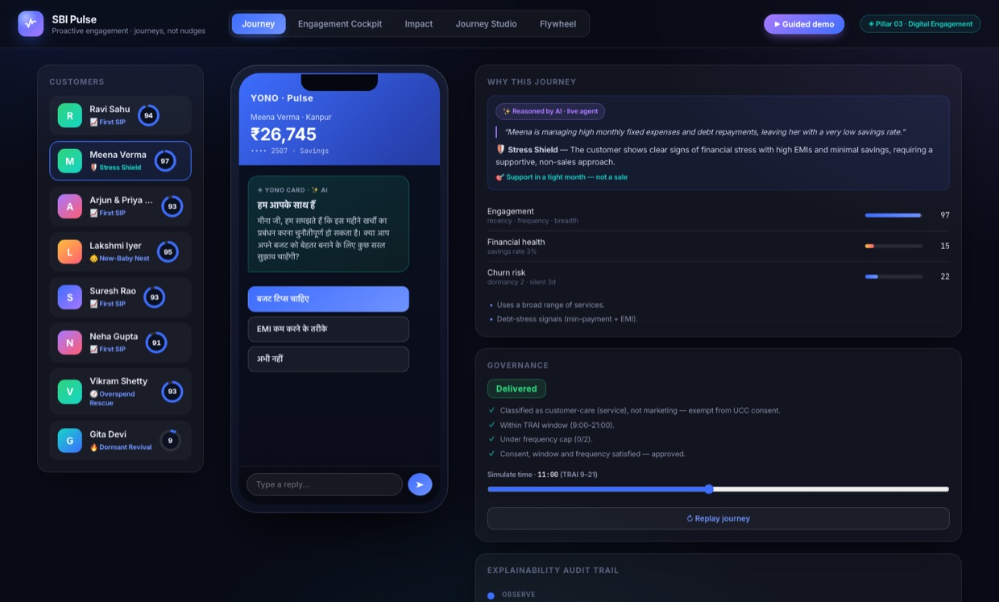
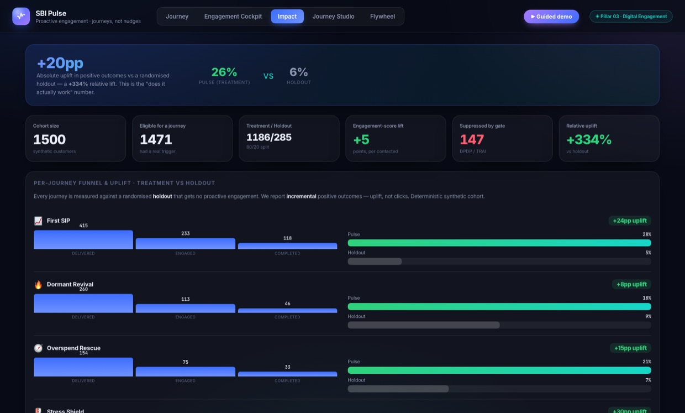
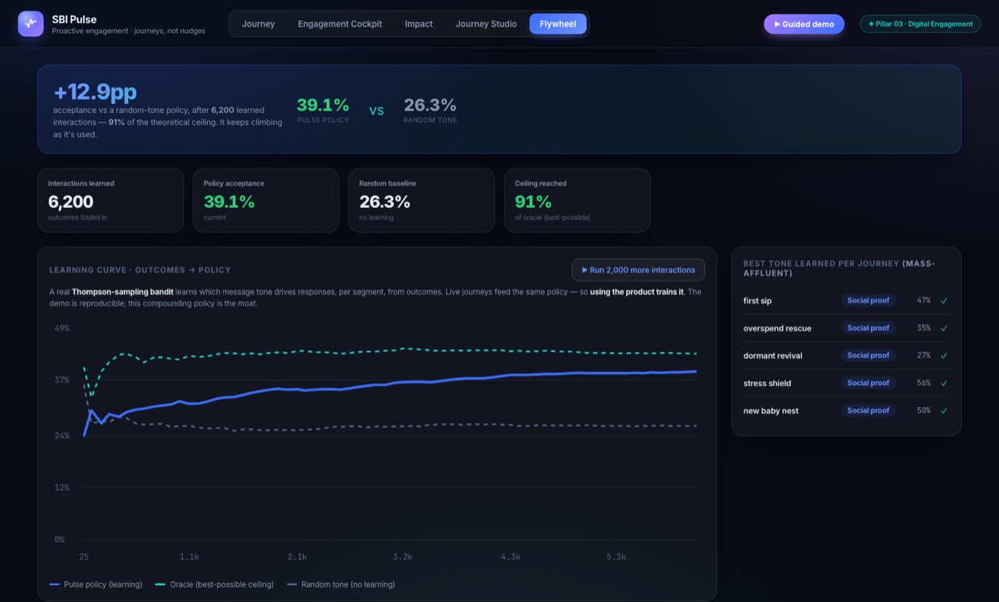
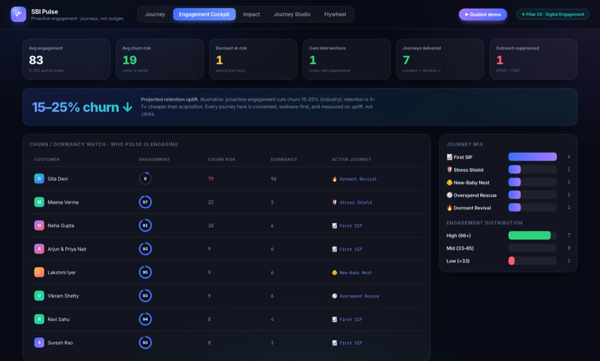
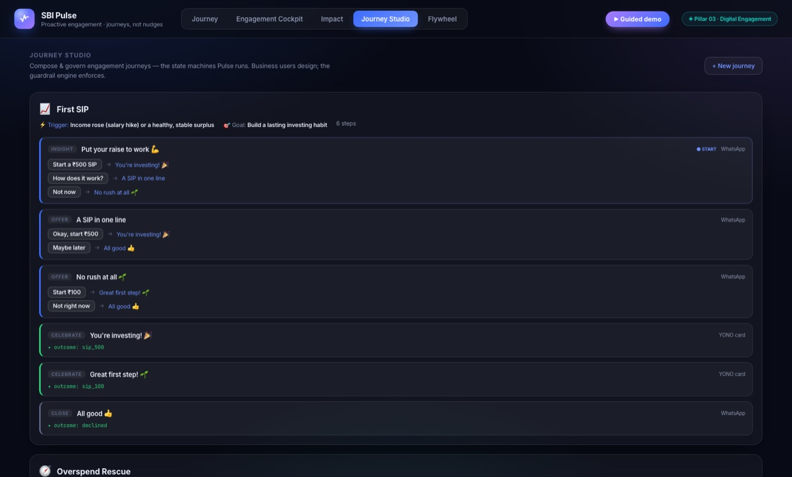

<div align="center">

# 🫀 SBI Pulse

### Agentic AI that runs proactive engagement **journeys, not nudges**

*Submission for the SBI Hackathon @ Global Fintech Fest 2026 — **Pillar 03 · Digital Engagement***




*The AI reads Meena's real transaction stream, detects financial stress, **suppresses cross-sell**,<br>and writes a care message — in Hindi. Every step lands on an explainability audit trail.*

</div>

---

## The problem (Pillar 03, verbatim)

> *"Create AI-driven engagement models that **proactively interact** with customers based on **behaviours, financial patterns, and life events**."*

SBI has ~100M digital users — but **34% of new accounts go dormant within a year** and cross-sell sits at **2.3 products per customer**. Banks answer with batch campaigns optimised for clicks. Result: fatigue, opt-outs, thin trust.

## The answer: stop sending nudges. Run journeys.

A **nudge** is one message. A **journey** is an adaptive, multi-step conversation the agent runs over time, branching on every reply:

| | |
|---|---|
| 📡 **Sense** | Life events & pattern shifts from the transaction stream — salary hike, relocation, new baby, overspend, dormancy, financial stress |
| ✨ **Reason** | A **live LLM agent** reads the actual transactions, infers the situation, and picks the journey — *or decides to stay silent* |
| 💬 **Engage** | Free-text conversation in the customer's language (**Hindi · Odia · English**), generated fresh — not templates |
| 🛡️ **Restrain** | On detected stress: **all cross-sell suppressed**, care offered instead. Knowing when *not* to sell is a decision |
| 🔁 **Learn** | Every outcome trains a Thompson-sampling policy — **using the product improves it** |

## ⚡ Quick start

```bash
# Requires Node 22+. No npm install — zero dependencies.
echo "GEMINI_API_KEY=your-key" > .env    # from https://aistudio.google.com/apikey
npm run web                               # → http://localhost:5173
```

No key? It still runs — a deterministic rule engine takes over (the ✨ AI badge just won't show).

```bash
npm run demo        # CLI demo: full reasoning trace for all 8 personas
```

## 🖥️ Five surfaces, one brain

| Surface | What it shows |
|---|---|
| **Journey** | YONO-style phone where the AI journey unfolds live — reasoning, vernacular chat, governance verdict, audit trail |
| **Engagement Cockpit** | Fleet view: engagement / churn / dormancy scores, journey mix, delivered vs suppressed |
| **Impact** | 1,500-customer cohort vs **randomised holdout** — **+20pp uplift**, measured on outcomes, not clicks |
| **Journey Studio** | Every journey as a governed, no-code **state machine** |
| **Flywheel** | The moat: a live learning curve climbing from random baseline toward the oracle ceiling |

<div align="center">
 
 
</div>

## 🏛️ Architecture — the AI proposes, policy disposes

```
Transactions / behaviours / life events
        │
        ▼
┌─────────────────────┐   ┌──────────────────────────┐   ┌─────────────────────────┐
│ SIGNAL & SCORING     │ → │ AI REASONING AGENT (LLM)  │ → │ GOVERNANCE GATE          │
│ engagement · health  │   │ reads real transactions,  │   │ deterministic CODE, not  │
│ churn · dormancy     │   │ infers situation, chooses │   │ AI: DPDP consent · TRAI  │
└─────────────────────┘   │ journey or SILENCE,       │   │ 9–9 window · freq caps · │
                          │ writes vernacular message │   │ stress→care · human-in-  │
                          └──────────────────────────┘   │ loop for high value      │
                                                          └────────────┬────────────┘
                                                                       ▼
┌──────────────────────────┐   ┌───────────────────────┐   ┌─────────────────────────┐
│ LEARN                     │ ← │ CONVERSE               │ ← │ DELIVER                  │
│ outcome → Thompson-       │   │ free-text, branches    │   │ YONO card / WhatsApp,    │
│ sampling policy; uplift   │   │ on every reply         │   │ customer's own language  │
│ vs randomised holdout     │   └───────────────────────┘   └─────────────────────────┘
└──────────────────────────┘
        every step → append-only EXPLAINABILITY AUDIT TRAIL
```

**Why this split matters for a bank:** the model can never bypass consent, contact windows or caps — those live in plain, reviewable code (`src/governance/consentGate.ts`). An auditor reads one file and knows exactly when a customer can be contacted.

## 📁 Project structure

```
src/
  ai/            gemini.ts (LLM client) · reasoner.ts (the reasoning agent)
  engagement/    scores.ts (engagement/health/churn) · cohort.ts (holdout uplift sim)
  journeys/      orchestrator.ts · definitions.ts (5 journeys) · i18n.ts (hi/or/en)
  governance/    consentGate.ts (deterministic gate) · ledger.ts (audit)
  learn/         bandit.ts (Thompson sampling) · flywheel.ts (outcome feedback loop)
  data/          generator.ts (seeded synthetic transactions) · personas.ts (8 personas)
  server/        server.ts (zero-dep node:http) · pulseApi.ts · engineApi.ts
web/             index.html · app.js · styles.css · deck.html   (no framework)
```

**~4,900 lines · 28 files · 0 npm dependencies · 1 command**

## ☁️ Deploy (Cloud Run)

```bash
gcloud run deploy sbi-pulse --source . --region asia-south1 \
  --allow-unauthenticated --set-env-vars GEMINI_API_KEY=your-key
```

The included `Dockerfile` runs the TypeScript natively on `node:22-alpine` — no build step.

## 🧭 Honest notes (read before judging)

- **Data is synthetic** — a deterministic, seeded transaction generator (zero PII by design). Production swaps in consented **Account Aggregator** + YONO event streams.
- **The AI is real** — a live LLM reasons over the transactions, decides, and converses. A rule engine is the automatic fallback so the demo never breaks.
- **The Impact numbers are a labelled simulation** of the holdout-uplift methodology that ships with the product — not field data.
- **The Flywheel's learning is real** (a genuine Thompson-sampling policy fed by live journey outcomes); its reward stream in the demo comes from synthetic ground truth so convergence is visible in seconds instead of months.

## 📚 Docs in this repo

| File | Purpose |
|---|---|
| `PILLAR3_DIGITAL_ENGAGEMENT_PLAN.md` | Full research-grounded product plan (phases 0–3) |
| `SUBMISSION.md` | Copy-paste answers for the submission form |
| `PITCH.md` · `VIDEO_SCRIPT.md` | 3-minute pitch script + video narration |
| `pulse-presentation.html` | 17-slide idea deck (open in browser, `F` for fullscreen) |

---

<div align="center">

**Journeys, not nudges · Knows when not to sell · Consent & explainability by design · Learns from every outcome**

*Built for Pillar 03 · Digital Engagement · Agentic AI & Emerging Tech — GFF 2026*

</div>
